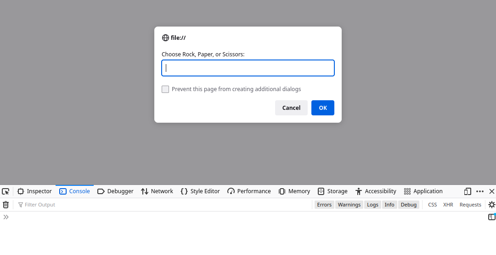
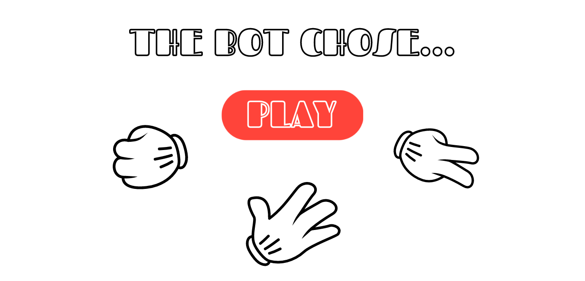
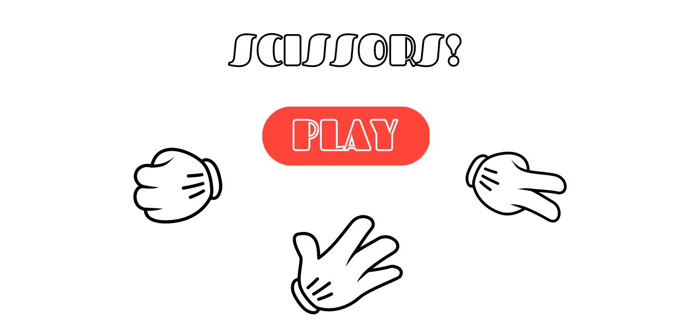
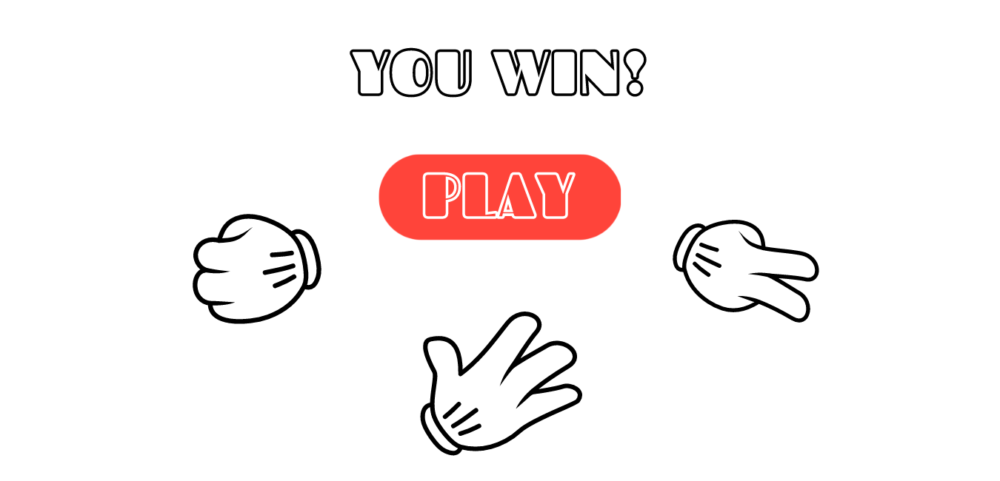

# rock-paper-scissors

This project is a simple implementation of the game "rock paper scissors." The outline for the project can be found [here.](https://www.theodinproject.com/paths/foundations/courses/foundations/lessons/rock-paper-scissors)

# Current Version 

[A demo of the website can be found here.](https://thejulianflores.github.io/rock-paper-scissors/)

The current version of the project is in beta. There are 5 total rounds in a game. Each game prompts the user to enter one of the three following choices:

1. Rock
2. Paper
3. Scissors

To see the results of the game, the user must have the console open. 



# Roadmap of the Project

1. The project will be implemented to work thorugh the console only with Javascript.

2. A GUI for the game will be created using HTML and CSS.

3. The Javascript and the GUI will be synthesized to create a fully-fledged working game.

# Part 1: Understanding the Project

The finished product will have a play button along with icons representing the choices for rock, paper, and scissors. 


Upon choosing and clicking on one of the three options, the game should tell you what the computer chose.




After a short amount of time, the game will announce the winner.



Slight animations will be added in future updates.

There will be 5 possible inputs in the game:

1. A "PLAY" button
2. A "ROCK" button
3. A "PAPER" button
4. A "SCISSORS" button
5. A "PLAY AGAIN" button

There will be 3 possible outputs in the game:

1. A header saying the player won
2. A header saying the player lost
3. A header declaring a tie game

# Part 2: Pseudo Code

The logic for the game is as follows:
```
When the user clicks the PLAY button
They will be instructed to choose one of three buttons
When the user clicks a button
Their choice is stored
A random number between 0 and 2 is chosen
The number is be used to choose Rock, Paper, or Scissors
If the player chose the winning button
Then the GUI will display that the player won
Else if the computer chose the winning button
Then the GUI will display that the computer won
Else the GUI will display that there was a tie
A PLAY AGAIN option will appear on screen
The GUI is paused until the player hits that button
```
