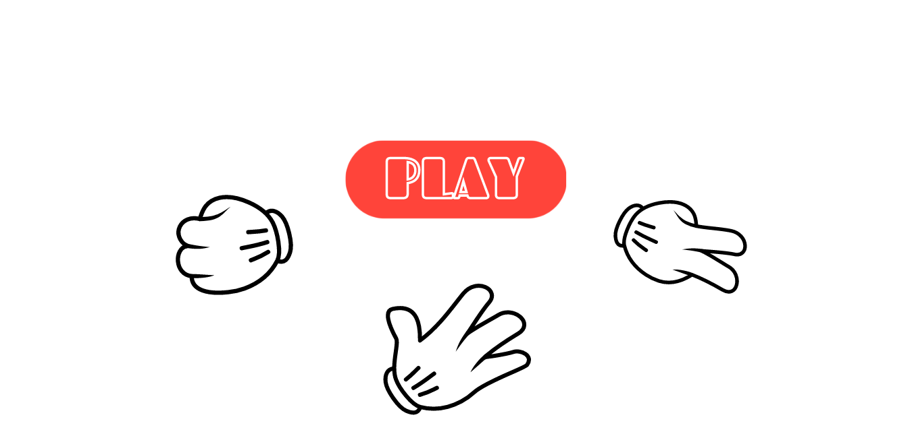

# rock-paper-scissors

This project is a simple implementation of the game "rock paper scissors." 

# Roadmap of the Project

1. The project will be implemented to work thorugh the console only with Javascript.

2. A GUI for the game will be created using HTML and CSS.

3. The Javascript and the GUI will be synthesized to create a fully-fledged working game.

# Part 1: Understanding the Project

The finished product will have a play button along with icons representing the choices for rock, paper, and scissors. 

Upon choosing and clicking on one of the three options, the game should tell you what the computer chose.

After a short amount of time, the game will announce the winner.

Slight animations will be added in future updates.

There will be 5 possible inputs in the game:

1. A "PLAY" button
2. A "ROCK" button
3. A "PAPER" button
4. A "SCISSORS" button
5. A "PLAY AGAIN" button

There will be 3 possible outputs in the game:

1. A header saying the player won
2. A header saying the player lost
3. A header declaring a tie game